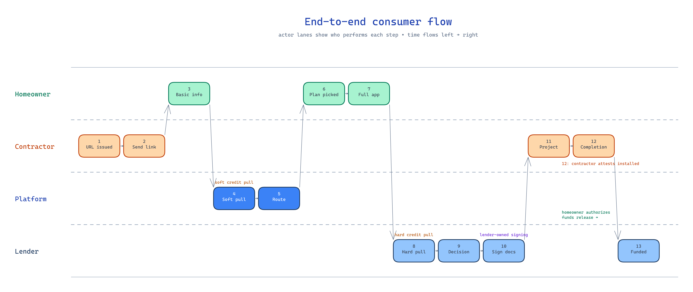
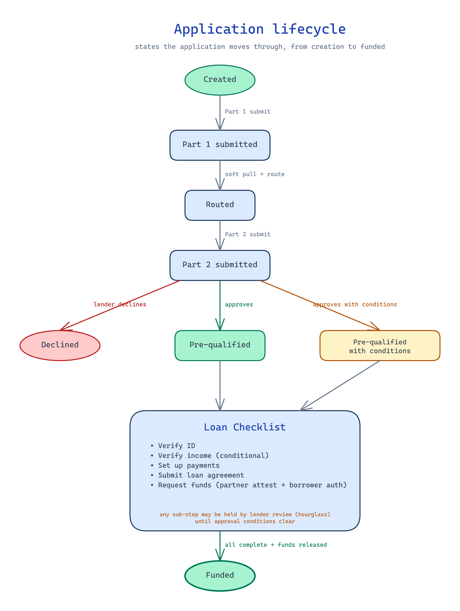

← [KB index](index.md)

# Application Flow

The end-to-end consumer flow from contractor URL handoff to contractor payment.

## Current State

13-step flow defined at the kickoff meeting (`docs/references/meetings/kickoff.md`, section on User roles and workflow). Not yet implemented.

## The 13 steps

*Source: [diagrams/application-flow-swimlane.excalidraw](diagrams/application-flow-swimlane.excalidraw)*

| # | Step | Actor | Notes |
|---|---|---|---|
| 1 | Contractor receives a unique application URL | Platform | URL is per-contractor (or per-merchant); links applications back to the originating contractor |
| 2 | Contractor sends the link to the homeowner or uses it during the in-home sale | Contractor | In-home sales context drives the mobile-friendly UX requirement |
| 3 | Homeowner enters basic information | Homeowner | Name, address, state, project category, consent for soft pull |
| 4 | Soft credit pull | Today: Lender. Target: Optimus | See [credit-pulls.md](credit-pulls.md) |
| 5 | System routes to the appropriate lender | Platform | Rules-based; prime first, step down on decline. See [lender-routing.md](lender-routing.md) |
| 6 | Homeowner picks from available loan plans | Homeowner | Plans are lender-specific; Optimus surfaces what the matched lender offers |
| 7 | Homeowner completes the lender-specific full application | Homeowner | Financing amount, project type, language preference, borrower details, SSN, DOB, billing address, income, employment, optional co-applicant, required disclosures |
| 8 | Lender performs hard credit pull | Lender | |
| 9 | Lender returns approval / pending / decline / lender-specific status | Lender | Statuses are returned via API/webhook and differ per lender. See [lender-integration-model.md](lender-integration-model.md) |
| 10 | Loan-document signing | Lender | Stays with lender for compliance/IDV reasons. See [loan-documents-and-signing.md](loan-documents-and-signing.md) |
| 11 | Contractor performs the project | Contractor | Out of platform — physical work |
| 12 | Contractor submits project completion | Contractor | Equipment details, brand, model #, serial #, project description, completion date, optional invoice. Lender then asks the homeowner to authorize funding. See [project-completion-and-funding.md](project-completion-and-funding.md) |
| 13 | Contractor is paid | Lender → Contractor | After homeowner funding authorization |

## Two origination modes

The backend must support **both** ways the homeowner enters the application, both first-class:

- **In-person co-completion** — partner and homeowner together (typical in-home sale). The partner opens the application on their device or hands the device to the homeowner; fields are filled together; consents are captured in front of the homeowner.
- **Invite-and-self-serve** — partner sends an email or text link; the homeowner opens it on their own device and completes the application alone, possibly later, possibly remote from the partner.

Mode is chosen at the moment of application creation (step 2 above). Many downstream steps (ID verification, document upload, signing) can be completed in either mode regardless of how the application started — see [partner-and-borrower-experience.md](partner-and-borrower-experience.md).

## Application is internally split into two parts

The "homeowner enters application" steps are not a single screen. The application has a soft-pull boundary in the middle:

- **Part 1 — pre-qualification** (corresponds to step 3 above): basic identity (name, DOB, contact), home address, project category and type, soft-pull consent, electronic-disclosures consent. Submit triggers the soft credit pull (step 4) and routing (step 5).
- **Part 2 — affordability** (corresponds to step 7 above): housing status, years at residence, monthly housing costs, gross annual income, employment status, employer details, occupation, industry, time at job, hard-pull consent. Submit triggers the hard credit pull (step 8) and the lender's pre-qualification decision (step 9).

Both parts are part of the same logical application record but they are submitted as discrete events, with distinct consent records and distinct credit-pull triggers. Once part 1 succeeds, the application is **pre-qualified at routing time** and routed to a lender; part 2 is then completed against that lender's specific affordability schema.

## Pre-qualification → Loan Checklist as a first-class state

*Source: [diagrams/application-lifecycle.excalidraw](diagrams/application-lifecycle.excalidraw)*

After part 2 returns a pre-qualification decision (step 9), the loan transitions into a **Loan Checklist** state — an enumerable list of sub-steps that must complete before funding can be requested:

- Verify identity (in-person partner verification, or borrower self-serve via the lender's remote identity verification flow — see [domain-glossary.md](domain-glossary.md) for IDV terminology)
- Verify income (only when threshold-gated; see [lender-integration-model.md](lender-integration-model.md))
- Set up payments (banking info via online-banking login, voided cheque image, or pre-authorized debit form)
- Submit loan agreement (borrower e-signs in either experience; see step 10 above and [loan-documents-and-signing.md](loan-documents-and-signing.md))
- Request funds (after project complete; see step 12 above and [project-completion-and-funding.md](project-completion-and-funding.md))

The backend must model the checklist as a first-class state with discrete sub-steps, each tracked independently for completion, lender-side review (approval conditions), and audit. Some sub-steps are partner-completable, some borrower-completable, some either — see [partner-and-borrower-experience.md](partner-and-borrower-experience.md).

## Key Decisions & Rationale

### Steps 11–13 are MVP-required, not a phase-2 nicety

**Why:** Contractor revenue lands at step 13. A loan platform that can't pay the contractor is not viable for MVP, regardless of how clean the front-half flow is. The kickoff explicitly called this an MVP requirement.

### Step 5 routes to a single lender, not a list

**Why:** Optimus is a rules-based broker, not a marketplace. The contractor doesn't pick. See [lender-routing.md](lender-routing.md).

### Steps 7 and 9 are lender-specific

**Why:** Each lender has its own application schema, disclosure set, IDV requirements, and status taxonomy. The platform must abstract these per-lender variations. See [lender-integration-model.md](lender-integration-model.md).

### Step 10 is delegated to the lender

**Why:** Pulling signing into Optimus would trigger additional IDV and compliance burden. See [loan-documents-and-signing.md](loan-documents-and-signing.md).

## Known Limitations

- The exact data fields per step beyond what kickoff lists are TBD — awaiting the business team's user stories and lender-specific requirements (kickoff section on Required follow-up materials).
- Lender-specific status values are not yet enumerated. Each integration will have to define its mapping into Optimus's internal status taxonomy.
- The unique application URL semantics (one-shot vs. reusable, expiry, branding, contractor identity proof) are not yet defined.

## Deferred / Future

- Mid-flow drop-off recovery (saved applications, resume links).
- Co-applicant flow details — kickoff lists co-applicant as optional in step 7 but doesn't define the co-borrower flow.

## Cross-References

See also: [domain-glossary.md](domain-glossary.md), [lender-routing.md](lender-routing.md), [credit-pulls.md](credit-pulls.md), [loan-documents-and-signing.md](loan-documents-and-signing.md), [project-completion-and-funding.md](project-completion-and-funding.md), [contractor-onboarding.md](contractor-onboarding.md), [partner-and-borrower-experience.md](partner-and-borrower-experience.md), [lender-integration-model.md](lender-integration-model.md).
