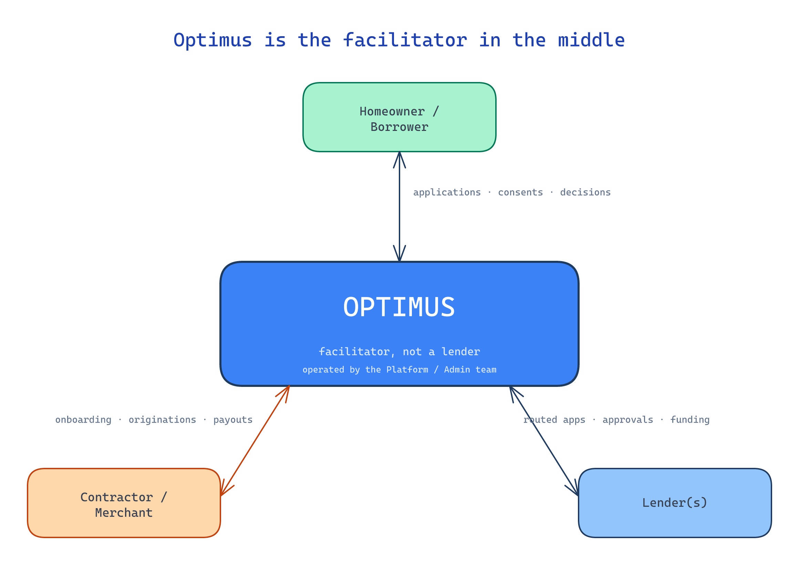

← [KB index](index.md)

# Domain Glossary

Actor roles and key terminology for the Optimus platform.

## Current State

Pre-implementation. Terminology and roles distilled from kickoff materials and from extracted summaries of legacy artifacts.

*Source: [diagrams/optimus-as-facilitator.excalidraw](diagrams/optimus-as-facilitator.excalidraw)*

## Actors

- **Homeowner / Borrower** — the customer receiving the loan. Lives in the U.S. or Canada. Owns a home and has a project they want financed.
- **Contractor / Merchant / Seller** — the contractor (HVAC, solar, roofing, etc.) that sells the home-improvement work and originates the loan application on the homeowner's behalf, typically during an in-home sales conversation.
- **Lender** — third-party financing partner. Multiple lenders are integrated; each runs its own application, statuses, disclosures, IDV, signing, and APIs.
- **Platform / Admin team** — internal Optimus operators. Configure routing, manage contractor and lender records, monitor operations. Sit *above* the tenant layer with role-gated cross-tenant access — not blanket superuser. See [ownership-and-tenancy.md](ownership-and-tenancy.md).

## Platform ownership and tenancy

Optimus owns the running deployment, the database, and the source-code repository. **Digital Rain Tech (DRT)** operates the platform on Optimus's behalf for a fee. Within the deployment, each contractor company is a **tenant** with isolated data; sales reps and other employees are users *within* that tenant. Borrowers are application-scoped (not tenants), and lenders are platform-level integrations (not tenants). The Optimus admin team operates above the tenant layer with role-gated cross-tenant access. For the full model, see [ownership-and-tenancy.md](ownership-and-tenancy.md).

## Application states (high-level)

- **Prequalification** — basic homeowner info (name, address, state, project category) plus consent for a soft credit pull. Outputs a routing decision and a set of available loan plans for the matched lender.
- **Full application** — lender-specific. Adds financing amount, project type, borrower details, SSN, DOB, billing address, income, employment, optional co-applicant, required disclosures.
- **Decision** — approval / pending / decline / lender-specific status. Statuses vary per lender.
- **Signing** — handled by the lender, not by Optimus. See [loan-documents-and-signing.md](loan-documents-and-signing.md).
- **Project completion** — contractor submits equipment details and a completion record. See [project-completion-and-funding.md](project-completion-and-funding.md).
- **Funding** — homeowner authorizes payout; contractor is paid by the lender.

## Credit pulls

- **Soft pull** — at prequal. No impact on the borrower's credit score. Currently performed by the lender; long-term target is for Optimus to own this pull. See [credit-pulls.md](credit-pulls.md).
- **Hard pull** — at full application submission. Performed by the lender.

## Identity verification (IDV)

Confirming the borrower is who they say they are. Required by lenders before underwriting and signing.

- **In-person partner verification** — the contractor visually inspects the borrower's photo ID, captures the ID details, and ticks a "verified by me" checkbox. No third-party service. Suitable when the partner is co-located with the borrower (typical in-home sale).
- **Remote IDV** — the borrower verifies their own identity on their own device, typically through a third-party service the lender operates. Common methods: document scan + selfie with face-match and liveness detection (e.g., Persona, Onfido, Stripe Identity), Knowledge-Based Authentication (KBA) using credit-bureau-sourced questions, bank-account-based verification (e.g., Plaid Identity), or eIDV database checks (e.g., LexisNexis).

Specific methods are **lender-specific** — each integrated lender determines what IDV flows it requires and operates the underlying vendor relationship. Optimus's adapter triggers the lender's flow and reads back the result. See [lender-integration-model.md](lender-integration-model.md).

## Lender tiers

- **Prime** — best-credit borrowers. Best rates, lowest acceptance variance.
- **Near-prime** — borrowers who don't qualify with the prime lender; sometimes called "second look" lenders.
- **Subprime** — borrowers below near-prime cutoffs.
- **Revolving** — alternative to amortizing loans (line-of-credit-style products).
- **Leasing** — equipment leasing as an alternative to a loan.

For MVP, only one prime + a defined fallback is in scope. The full breadth of tier-and-product variations the eventual platform must accommodate is broader; see [lender-integration-model.md](lender-integration-model.md).

## "Pathway" vs "Program"

The legacy site uses both terms:

- **Pathway** — the tier (Prime Pathway, Near-Prime Pathway, etc.).
- **Program** — the specific lender product within a pathway (Standard Credit Program, Extended Credit Program, etc.).

Whether to keep this taxonomy in the rewrite is a design decision deferred to when business rules arrive. The terminology is preserved here for cross-reference with legacy material.

## Cross-References

See also: [application-flow.md](application-flow.md), [lender-routing.md](lender-routing.md), [credit-pulls.md](credit-pulls.md), [partner-and-borrower-experience.md](partner-and-borrower-experience.md).
