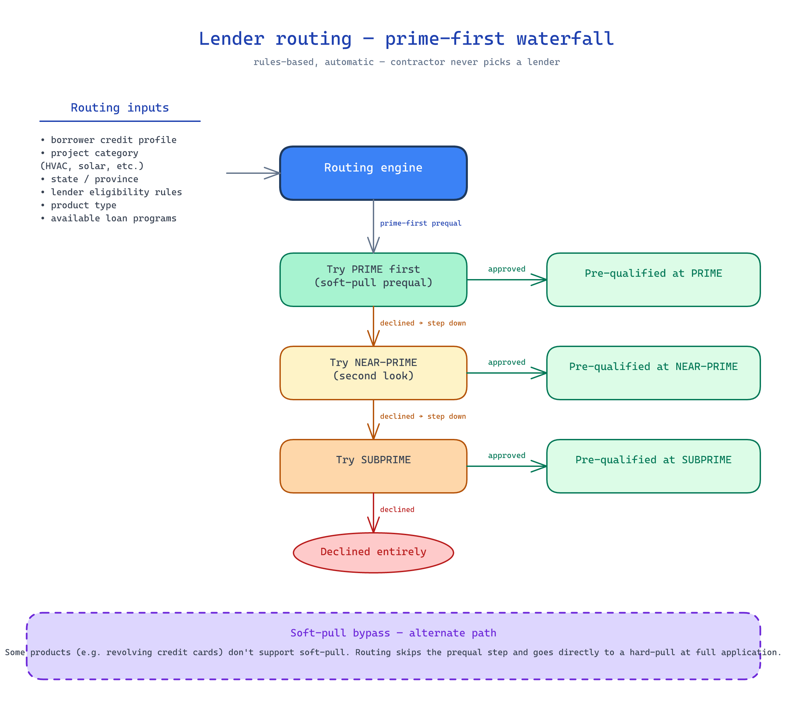

← [KB index](index.md)

# Lender Routing

How Optimus picks a lender for an incoming application.

## Current State

Pre-implementation. Routing rules are defined at the level of inputs and tier logic; the actual decision tree is TBD and owed by the business team.

## How It Works

*Source: [diagrams/lender-routing.excalidraw](diagrams/lender-routing.excalidraw)*

Routing is **automatic and rules-based**. The contractor never sees a lender list and never picks. The platform decides.

### Routing inputs

- Borrower credit profile (from soft pull at prequal)
- Project category (HVAC, solar, battery storage, roofing, windows, etc.)
- State / province / location (Optimus serves both U.S. and Canada)
- Lender eligibility rules (per-lender; e.g., a lender may not operate in a given state, or may exclude a project category)
- Product type
- Available loan programs for the matched lender

### Tier model

General lender structure: **prime → near-prime → subprime**. Multiple prime lenders may eventually exist, specialized per product category (e.g., one prime for HVAC, another for solar). Revolving and leasing pathways may also coexist as alternative products.

### Prime-first prequalification (departure from legacy)

The new platform should attempt to **prequalify the customer through the prime lender first** before routing them to a lower-tier lender. Goal: maximize approval quality before stepping down. This is an explicit improvement over the current legacy behavior.

### MVP routing

MVP starts with **one prime lender + a defined fallback**, not the full multi-tier matrix. The fallback is a single near-prime or subprime path; details TBD.

### Some product types bypass the soft pull

Not every lender product uses soft-pull-at-prequal. Some products — notably revolving-credit-card products — go directly to a hard pull at application time without a soft-pull prequal. The routing layer must accommodate this:

- For products that don't support soft-pull, the prequal step is either skipped or replaced with a different prequal pattern (e.g., a basic eligibility check that doesn't pull credit).
- The routing decision itself may need to take "supports soft-pull" as an input, so a soft-pull-bypassing product is only matched when appropriate.

**MVP implication:** The chosen prime lender's soft-pull support must be confirmed during integration. If the MVP prime lender does not support soft-pull, the prequal flow needs an alternate path or the prequal step is collapsed into the full application.

## Key Decisions & Rationale

### Rules-based, not a marketplace

**Why:** The kickoff explicitly framed contractor decision-making as friction to remove. The contractor's job is to enter or send the customer into the system; the platform should determine the right lender. A marketplace pattern would push lender choice back to the contractor, which the business team rejected.

### Prime-first prequalification

**Why:** Stepping down on credit-tier failure (rather than starting at a lower tier and never trying prime) means more borrowers reach the best available terms. This is one of the explicit improvements the new platform makes over legacy.

### Single prime + fallback for MVP

**Why:** The full multi-prime / multi-tier matrix multiplies the lender-integration cost (currently 30–60 days per lender). Starting narrow lets the team prove the routing abstraction with one lender pair before scaling. See [lender-integration-model.md](lender-integration-model.md).

## Known Limitations

- The actual decision tree (which inputs gate which lenders, in what order) is TBD — owed by the business team (kickoff section on Required follow-up materials: business rules, decision trees, lender routing logic).
- No data on how often each routing input alone determines the outcome; routing-rule precedence is unknown.
- State-by-state lender eligibility rules are not yet documented.

## Deferred / Future

- Multi-prime-per-product-category routing.
- Routing-rule admin UI for the platform/admin team to edit live.
- A/B testing or shadow-routing to compare strategies.
- Routing input enrichment beyond the soft pull (e.g., property data, third-party signals).

## Cross-References

See also: [application-flow.md](application-flow.md), [credit-pulls.md](credit-pulls.md), [lender-integration-model.md](lender-integration-model.md), [mvp-scope.md](mvp-scope.md).
