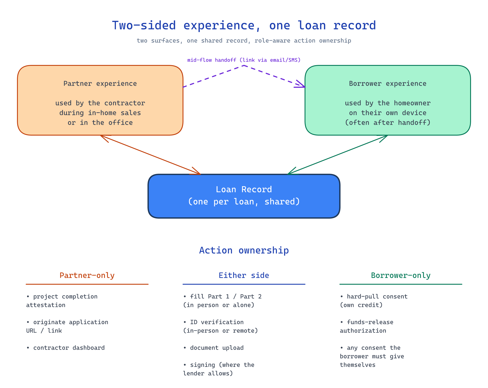

← [KB index](index.md)

# Partner and Borrower Experience

The two-sided experience model the Optimus backend must support: a contractor-facing surface and a homeowner-facing surface that share a common loan record.

## Current State

Pre-implementation. Pattern derived from how the legacy origination and funding flow operates and from the kickoff's mobile / in-home-sales context.

## How It Works

*Source: [diagrams/two-sided-experience.excalidraw](diagrams/two-sided-experience.excalidraw)*

The backend supports **one logical loan record** worked on through **two distinct user experiences**:

- **Partner experience** — used by the contractor / merchant during in-home sales, in the office, or anywhere the contractor manages loans. Mobile-friendliness matters: this is often used on a phone or tablet during the sale itself.
- **Borrower experience** — used by the homeowner on their own device, often after the partner has handed off control mid-flow (link sent via email/text), or independently after the partner has done initial steps. Also mobile-friendly by necessity.

Both experiences read from and write to the **same loan record**. State changes by either side are visible to the other.

### Action ownership model

Some actions are **role-locked** — only one side can complete them:

- **Partner-only:** project-completion attestation ("installed or delivered"), originating a new application URL, working in the contractor dashboard.
- **Borrower-only:** funds-release authorization, hard-pull consent on part 2 of the application (must be the borrower's own consent capture).

Some actions are **flexible** — either side can complete them, depending on context:

- Filling out the application (part 1 and part 2) — partner can co-complete with the borrower in person, or the borrower can complete alone.
- ID verification — partner can verify in person (visual ID check), or the borrower can self-verify remotely.
- Document upload (proof of income, banking, voided cheque) — partner can upload during the in-person session, or borrower can upload independently.
- Loan-document signing — depends on the lender; some allow partner-witnessed signing in the partner experience, others require borrower-direct in the borrower experience.

### Handoff mechanics

Mid-flow handoff between the two experiences must be smooth:

- Partner starts an application in person, then sends a link to the borrower to finish later.
- Partner completes most steps in person except the borrower's funds-release authorization, which always goes to the borrower's channel.
- Borrower can return to a partially-completed application via a persistent link.

Each handoff implies:

- State preservation across sessions / devices.
- Identity binding (the link must reach the right borrower; resumed sessions must re-authenticate).
- Audit trail showing who did what when.

## Key Decisions & Rationale

### One loan record, two experiences

**Why:** Splitting into separate records per experience would force reconciliation logic and create state divergence (duplicate submissions, conflicting field updates, etc.). One record with role-aware access is the cleaner model.

### Action ownership is per-action, not per-experience

**Why:** Some actions absolutely must be borrower-driven for compliance — the borrower's own credit consent, the borrower's own funds-release authorization. Others can be either-or for ergonomics — in-person form-filling vs. self-serve. Hard-coding "the borrower experience does X, the partner experience does Y" would prevent the mixed in-person + self-serve flows the in-home-sales context requires.

### Mobile-friendliness applies to both surfaces

**Why:** The partner experience is used on phones during in-home sales (the contractor often hands their phone to the homeowner). The borrower experience is used on whatever device the homeowner has at hand, increasingly mobile. Either surface being desktop-only breaks the primary use case.

## Known Limitations

- The exact authentication / identity-binding rules for borrowers (especially when the partner started the application) are not yet specified — magic-link, passwordless email, SMS OTP, etc.
- Whether the partner experience and borrower experience are two separate apps, two views of one app, or two responsive web surfaces is a tech-stack decision deferred.
- Real-time vs. polled state sync between the two experiences is unspecified — relevant when the partner and borrower are using their experiences concurrently.

## Deferred / Future

- **Co-applicant experience.** When a co-applicant is added, do they get their own borrower-experience link or share the primary borrower's? Authentication and consent capture for co-applicants is its own scoping job.
- **Branding-per-contractor on the borrower experience** — white-label / co-branded handoff so the borrower sees a coherent contractor-branded flow.
- **In-app messaging** between partner and borrower during a live application.
- **Partner team members / sub-accounts** with role-specific access in the partner experience.

## Cross-References

See also: [application-flow.md](application-flow.md), [project-completion-and-funding.md](project-completion-and-funding.md), [credit-pulls.md](credit-pulls.md), [contractor-onboarding.md](contractor-onboarding.md), [mvp-scope.md](mvp-scope.md), [tech-stack/authentication.md](tech-stack/authentication.md) (the realized auth model — Auth0 for partners, one-time URLs for borrowers), [tech-stack/mobile-and-pwa.md](tech-stack/mobile-and-pwa.md) (mobile-first as the default surface for both experiences).
