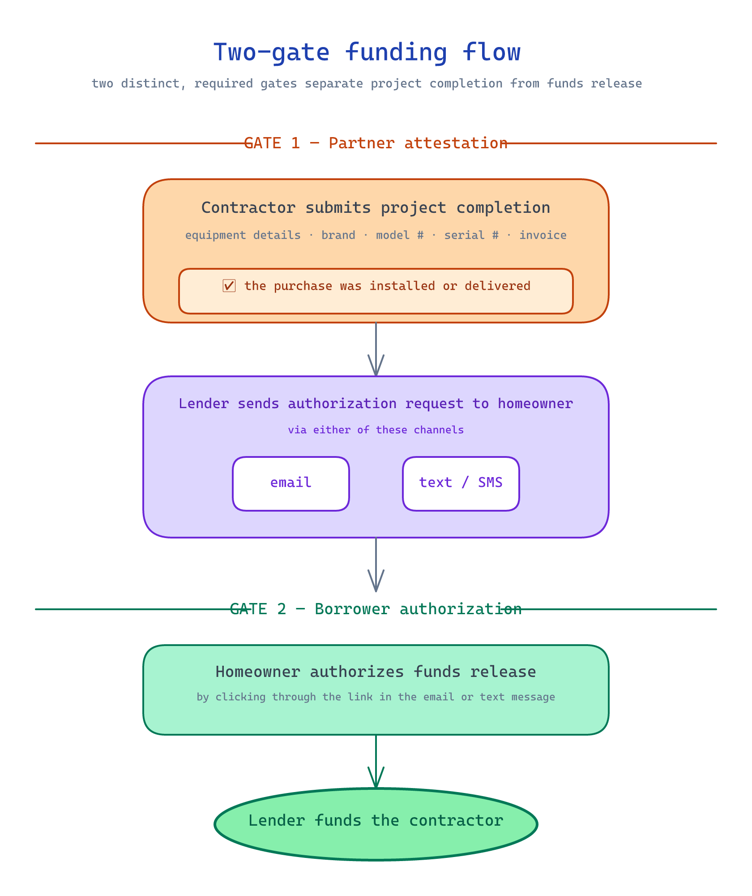

← [KB index](index.md)

# Project Completion and Funding

Steps 11–13 of the consumer flow: contractor finishes the work, homeowner authorizes funding, contractor is paid.

## Current State

Pre-implementation. Required for MVP — not a phase-2 feature.

## How It Works

*Source: [diagrams/two-gate-funding.excalidraw](diagrams/two-gate-funding.excalidraw)*

### Step 11 — contractor performs the project

Out of platform. Physical work.

### Step 12 — contractor submits project completion

Contractor enters:

- Equipment details
- Purchase location
- Brand
- Model number
- Serial number
- Project description
- Completion date
- Optional invoice attachment

Submitted to Optimus, which forwards to the lender via that lender's API (or however the lender wants to consume it — see [lender-integration-model.md](lender-integration-model.md)).

### Step 12.5 — homeowner funding authorization (lender-driven)

Once project completion is submitted, the lender sends a text or email to the homeowner asking them to authorize funds release / payment to the contractor.

### Step 13 — contractor is paid

Once authorized, the lender funds the contractor.

## Two gates before funds release

Funding is gated on **two distinct events**, both required:

1. **Partner attestation** — the contractor checks "the purchase was installed or delivered" inside the project-completion submission. Without this attestation, the funds-release request cannot be sent to the homeowner.
2. **Borrower authorization** — after the partner attests and submits, a request is sent to the homeowner asking them to authorize the release of funds. The homeowner authorizes by clicking through a link in an email or text message and confirming in the borrower experience.

Both gates exist for compliance and fraud-prevention reasons:

- The partner cannot unilaterally trigger funding — homeowner authorization is required.
- The homeowner cannot authorize without the partner having declared the work done — funding does not run before delivery.

The backend must model these as two distinct state transitions with separate timestamps and audit records.

## Authorization request channels

The funds-release authorization request supports **email and text** — both delivered through the lender's notification system or through Optimus's, depending on the lender integration. The platform does **not** operate a phone-based authorization channel.

If a lender separately runs a call center that accepts verbal authorizations, the resulting authorization event flows back to Optimus via the same webhook as digital channels — but operating the phone channel is the lender's concern, not the platform's.

## Key Decisions & Rationale

### MVP-required

**Why:** This is where contractor revenue lands. A platform that takes loans from prequal to approval but can't get the contractor paid is not commercially viable. Kickoff explicitly flagged steps 11–13 as MVP, not a later phase.

### Authorization is lender-side

**Why:** Same logic as document signing — the homeowner-authorizes-funds step is part of the lender's loan-funding workflow. Optimus's role is to make sure the lender has what it needs (the project completion record) and to surface progress in the contractor dashboard.

### Equipment serial-number capture is contractor-entered

**Why:** The kickoff lists serial number as a captured field. This is consistent with rebate processing and warranty tracking patterns common in HVAC and solar — the lender (or downstream rebate program) wants the data for compliance and product registration, not just funding.

## Known Limitations

- It is not yet known which lenders require which subset of the equipment fields, or whether photos/proofs of installation are required.
- The contractor-side UX for collecting these fields (during the in-home install vs. afterwards in the office) is not yet designed.
- Multi-equipment installs (e.g., HVAC + battery on the same loan) are not yet scoped.

## Deferred / Future

- Rebate processing tied into project completion.
- Photo / proof-of-install attachments per lender.
- Push notifications to the contractor when the homeowner authorizes funds.
- Integration with contractor accounting tools.

## Cross-References

See also: [application-flow.md](application-flow.md), [lender-integration-model.md](lender-integration-model.md), [contractor-onboarding.md](contractor-onboarding.md), [mvp-scope.md](mvp-scope.md).
